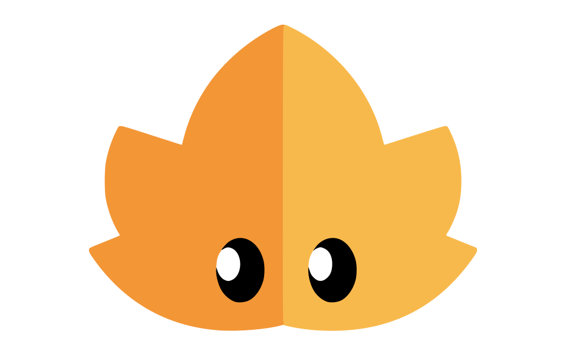

<div align="center">
  <a href="https://discord.gg/eqYgbVtzCu" alt="Discord" title="CF server"></a>
</div>&nbsp;

<div align="center">
  
</div>

---


<div align="center">
  
  
  
</div>

<div align="center">
<table style="background-color: black; color: white; border: none; border-radius: 15px; overflow: hidden;">
  <thead>
    <tr>
      <th colspan="16" align="center" style="color: white;">Langs</th>
    </tr>
  </thead>
  <tbody>
    <tr>
      <td align="center" style="border: none;">
        
        <br>&nbsp;&nbsp;&nbsp;Rust&nbsp;&nbsp;&nbsp;
      </td>
      <td align="center" style="border: none;">
        
        <br>&nbsp;&nbsp;&nbsp;Cpp&nbsp;&nbsp;&nbsp;&nbsp;
      </td>
      <td align="center" style="border: none;">
        
        <br>&nbsp;&nbsp;&nbsp;Lua&nbsp;&nbsp;&nbsp;&nbsp;
      </td>
      <td align="center" style="border: none;">
        
        <br>TypeScript
      </td>
      <td align="center" style="border: none;">
        
        <br>&nbsp;&nbsp;&nbsp;&nbsp;C&nbsp;&nbsp;&nbsp;&nbsp;&nbsp;
      </td>
      <td align="center" style="border: none;">
        
        <br>&nbsp;&nbsp;&nbsp;&nbsp;Go&nbsp;&nbsp;&nbsp;&nbsp;
      </td>
      <td align="center" style="border: none;">
        
        <br>JavaScript
      </td>
      <td align="center" style="border: none;">
        
        <br>&nbsp;&nbsp;Swift&nbsp;&nbsp;&nbsp;
      </td>
      <td align="center" style="border: none;">
        
        <br>&nbsp;&nbsp;ObjC&nbsp;&nbsp;&nbsp;
      </td>
      <td align="center" style="border: none;">
        
        <br>&nbsp;&nbsp;Python&nbsp;&nbsp;
      </td>
      <td align="center" style="border: none;">
        
        <br>&nbsp;&nbsp;&nbsp;SQL&nbsp;&nbsp;&nbsp;&nbsp;
      </td>
      <td align="center" style="border: none;">
        
        <br>&nbsp;&nbsp;&nbsp;Mojo&nbsp;&nbsp;&nbsp;
      </td>
      <td align="center" style="border: none;">
        
        <br>&nbsp;&nbsp;&nbsp;Ruby&nbsp;&nbsp;&nbsp;
      </td>
      <td align="center" style="border: none;">
        
        <br>&nbsp;&nbsp;&nbsp;Java&nbsp;&nbsp;&nbsp;
      </td>
      <td align="center" style="border: none;">
        
        <br>&nbsp;&nbsp;Crystal&nbsp;&nbsp;
      </td>
      <td align="center" style="border: none;">
        
        <br>&nbsp;Solidity&nbsp;
      </td>
    </tr>
  </tbody>
</table>
</div>

<div align="center">
<table style="background-color: black; color: white; border: none; border-radius: 15px; overflow: hidden;">
  <thead>
    <tr>
      <th colspan="10" align="center" style="color: white;">Frontend</th>
    </tr>
  </thead>
  <tbody>
    <tr>
      <td align="center" style="border: none;">
        
        <br>Sycamore
      </td>
      <td align="center" style="border: none;">
        
        <br>React
      </td>
      <td align="center" style="border: none;">
        
        <br>&nbsp;&nbsp;Lume&nbsp;&nbsp;
      </td>
      <td align="center" style="border: none;">
        <br>Fresh
      </td>
      <td align="center" style="border: none;">
        <br>Svelte
      </td>
      <td align="center" style="border: none;">
        
        <br>&nbsp;Vercel&nbsp;
      </td>
      <td align="center" style="border: none;">
        <br>Node.js
      </td>
      <td align="center" style="border: none;">
        
        <br>&nbsp;&nbsp;Deno&nbsp;&nbsp;
      </td>
      <td align="center" style="border: none;">
        
        <br>Bun.js
      </td>
      <td align="center" style="border: none;">
        
        <br>Tailwind
      </td>
    </tr>
  </tbody>
</table>
</div>

<div align="center">
<table style="background-color: black; color: white; border: none; border-radius: 15px; overflow: hidden;">
  <thead>
    <tr>
      <th colspan="10" align="center" style="color: white;">Backend</th>
    </tr>
  </thead>
  <tbody>
    <tr>
      <td align="center" style="border: none;">
        
        <br>Rocket
      </td>
      <td align="center" style="border: none;">
        
        <br>CrowCpp
      </td>
      <td align="center" style="border: none;">
        
        <br>Nginx
      </td>
    </tr>
  </tbody>
</table>
</div>

<picture>
  <source
    media="(prefers-color-scheme: dark)"
    srcset="https://github.com/qwexpert/qwexpert/blob/output/github-contribution-grid-snake-dark.svg"
  />
  <source
    media="(prefers-color-scheme: light)"
    srcset="https://raw.githubusercontent.com/platane/snk/output/github-contribution-grid-snake.svg"
  />
  
</picture>

---

> [!NOTE]
> [Default.gitignore](https://github.com/qwexpert/qwexpert/blob/main/.gitignore)
---

<h3 align="center">Lua libraries compiling</h3>

```zsh
gcc -shared -o name_module.so -fPIC name_module.cpp -I/PATH_TO_LUA/include/lua5.4 -L/PATH_TO_LUA/lib -llua


example:

g++ -shared -o name_module.so -fPIC name_module.cpp -I$(brew --prefix lua)/include/lua5.4 -L$(brew --prefix lua)/lib -llua
Compiling   1 hrs 12 mins   ███████████████████▒░░░░░   76.89 %
```
